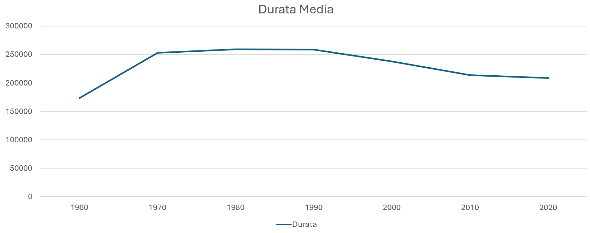
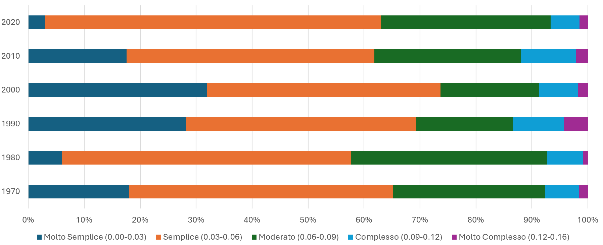
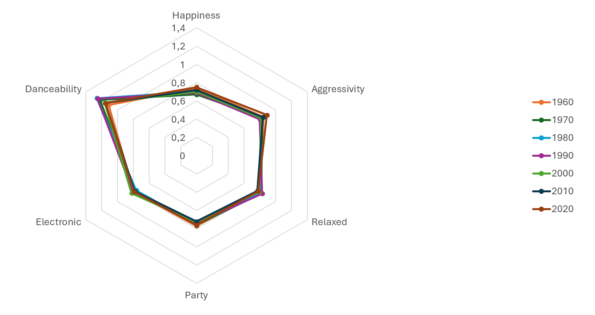

# Analisi dell’evoluzione e del successo musicale in PROLOG

## Introduzione

Questo progetto si propone di analizzare l'evoluzione delle hit musicali nel tempo attraverso un approccio basato sul Machine Learning e sulla Programmazione Logica. L'obiettivo principale è identificare i pattern e le caratteristiche che definiscono il successo commerciale dei brani musicali, esaminando come questi si sono evoluti nel corso dei decenni.

Il progetto si inserisce nell'ambito dell'apprendimento automatico supervisionato, utilizzando tecniche di data mining e pattern recognition per estrarre conoscenza significativa da un dataset di canzoni di successo. L'approccio metodologico combina l'analisi statistica tradizionale con tecniche di machine learning, implementate attraverso PROLOG per il reasoning automatico.

## Acquisizione e Strutturazione dei Dati

### Sistema di Scraping Multi-Source

Il processo di raccolta dati è stato implementato attraverso un sistema di scraping modulare in Python che integra diverse fonti:

1. **Billboard Scraper**: Estrae lo storico delle hit dalla Billboard Hot 100
2. **MusicBrainz Integration**: Recupera metadati e informazioni di release
3. **AcousticBrainz Analysis**: Ottiene caratteristiche audio e musicali attraverso analisi algoritmica
4. **LastFM**: genere musicale

Ecco un esempio della struttura principale dello scraper Billboard:

```python
class BillboardDataCollector:
    def __init__(self):
        self.logger = setup_logging()

    def get_billboard_tracks(self, start_year, end_year):
        billboard_tracks = []
        seen_tracks = set()
        sample_months = [2, 4, 6, 8, 10, 12]

        for year in range(start_year, end_year + 1):
            for month in sample_months:
                try:
                    date = f"{year}-{month:02d}-01"
                    chart = ChartData('hot-100', date=date)

                    for entry in chart:
                        track_key = (entry.title.lower(), entry.artist.lower())
                        if track_key not in seen_tracks:
                            track_info = {
                                'title': entry.title,
                                'artist': entry.artist,
                                'peak_position': entry.peakPos,
                                'weeks_on_chart': entry.weeks,
                                'first_appearance': date
                            }
                            billboard_tracks.append(track_info)
```

Come si può vedere dal codice sono stati scelti brani con cadenza bimestrale, questo per rendere il processo di scraping più agevole, essendo già particolarmente lungo dovuto a rate-limit della piattaforma.

### Integrazione con AcousticBrainz

Particolare rilevanza ha l'integrazione con [AcousticBrainz](https://acousticbrainz.org/data), una piattaforma che utilizza Essentia, un framework di analisi audio basato su AI, per estrarre caratteristiche musicali ad alto livello. 

Questa integrazione rappresenta un punto critico del progetto, in quanto si basa su caratteristiche musicali estratte algoritmicamente dal segnale audio.

#### Caratteristiche Estratte

AcousticBrainz fornisce due livelli di analisi:

**Low-level Features:**

- Caratteristiche spettrali (centroide, rolloff, flux)
- Analisi ritmica dettagliata (onset detection, beat tracking)
- MFCC (Mel-frequency cepstral coefficients)
- Loudness e dynamic range
- Caratteristiche armoniche (pitch class profiles)

**High-level Features:**

- Tonalità e modalità (key/scale detection)
- BPM e caratteristiche ritmiche aggregate
- Danceability (basata su pattern ritmici e regolarità)
- Mood/emozioni (attraverso modelli di machine learning)
- Chord progression e tasso di cambio accordi

#### Affidabilità e Limiti

L'utilizzo di features estratte algoritmicamente presenta vantaggi e limitazioni:

**Vantaggi:**

- Consistenza nell'analisi su larga scala
- Oggettività delle misurazioni
- Possibilità di analizzare caratteristiche difficilmente quantificabili manualmente
- Standardizzazione delle metriche

**Limitazioni:**

- Possibili errori nell'estrazione delle features
- Bias degli algoritmi di analisi
- Semplificazione di caratteristiche musicali complesse
- Dipendenza dalla qualità della registrazione audio

Il sistema implementa una gestione robusta delle richieste API:

```python
def get_acousticbrainz_data(self, mbid):
    if mbid in self.cache["acousticbrainz"]:
        return self.cache["acousticbrainz"][mbid]

    try:
        url = f"https://acousticbrainz.org/api/v1/{mbid}/high-level"
        response = requests.get(url)
        if response.status_code == 200:
            data = response.json()

            # Get low-level features
            low_level_url = f"https://acousticbrainz.org/api/v1/{mbid}/low-level"
            low_level_response = requests.get(low_level_url)
            if low_level_response.status_code == 200:
                low_level_data = low_level_response.json()
                data["lowlevel"] = low_level_data

            self.cache["acousticbrainz"][mbid] = data
            return data
```

### Pulizia del Dataset

La pulizia e normalizzazione dei dati è gestita attraverso procedure automatizzate che verificano la completezza e la coerenza delle informazioni, come mostrato nel codice di filtering:

```python
def has_all_required_attributes(song):
    required_attrs = get_required_attributes()

    for attr in required_attrs:
        if attr not in song or song[attr] is None:
            return False

    try:
        release_date = datetime.strptime(song['original_release_date'], '%Y-%m-%d')
        entry_date = datetime.strptime(song['first_entry_date'], '%Y-%m-%d')

        if release_date > entry_date:
            song['original_release_date'] = song['first_entry_date']
            date_fields = calculate_date_fields(song['first_entry_date'])
            song.update(date_fields)
    except (ValueError, TypeError):
        date_fields = calculate_date_fields(song['first_entry_date'])
        song.update(date_fields)

    return True
```

In particolare sono stati scartati i brani che non hanno tutte le caratteristiche. Molti brani avevano la data di rilascio erratta ed è quindi stata sostituita con quella in ingresso nella classifica Billboard.

Questa strutturazione dei dati fornisce una base solida per l'analisi successiva attraverso tecniche di machine learning e pattern recognition implementate in PROLOG. 

## Struttura del Database

Il database è stato progettato per rappresentare in modo completo le caratteristiche delle hit musicali attraverso una struttura relazionale in PROLOG, organizzata in cinque predicati principali che catturano diversi aspetti di ogni brano.

### Organizzazione dei Predicati

#### 1. Metadati Base (song/5)

Il predicato `song/5` gestisce le informazioni fondamentali di ogni brano:

```prolog
song(Song_ID, Title, Artist, Length, Genre)
```

Questo predicato memorizza:

- Un identificatore univoco (Song_ID)
- Il titolo del brano
- L'artista o band
- La durata in millisecondi
- Il genere musicale principale

La <u>determinazione del genere primario</u> è stata implementata attraverso un sistema di normalizzazione che mappa i tag musicali più specifici in categorie più ampie. Questo approccio è stato necessario per gestire la grande varietà di sotto-generi e tag musicali presenti nei dati di LastFM.

Quando un brano presenta più tag, il genere primario viene determinato contando le occorrenze dei generi normalizzati e selezionando quello con la frequenza maggiore. Ad esempio, una canzone taggata come "synth-pop", "dance pop" e "electropop" verrebbe classificata come "pop", essendo tutti e tre i tag mappati alla categoria principale "pop".

Questo approccio permette di:

- Ridurre la frammentazione dei generi
- Standardizzare la classificazione
- Gestire le sovrapposizioni tra generi
- Mantenere una tassonomia musicale coerente

La mappatura include 13 categorie principali (pop, rock, hiphop, r&b, electronic, jazz, classical, country, latin, metal, blues, reggae, world), ciascuna con i propri sotto-generi caratteristici.

#### 2. Attributi Musicali (musical_attributes/6)

```prolog
musical_attributes(Song_ID, Key, Mode, BPM, Danceability, Chord_Change_Rate)
```

Cattura le caratteristiche tecniche e strutturali della composizione:

- Tonalità (Key) 
- Modo musicale (major/minor)
- Tempo in BPM
- Indice di ballabilità
- Tasso di cambio degli accordi

#### 3. Attributi Emotivi (mood_attributes/6)

```prolog
mood_attributes(Song_ID, Happy, Aggressive, Relaxed, Party, Electronic)
```

Rappresenta gli aspetti emotivi e percettivi del brano, con valori normalizzati tra 0.5 e 1:

- Livello di felicità percepita
- Aggressività
- Rilassatezza
- Attitudine festosa
- Presenza di elementi elettronici

#### 4. Performance Commerciale (commercial_performance/3)

```prolog
commercial_performance(Song_ID, Chart_Position, Weeks_Chart)
```

Traccia il successo commerciale attraverso:

- Posizione massima raggiunta in classifica
- Numero di settimane di permanenza

#### 5. Dati Temporali (temporal_data/5)

```prolog
temporal_data(Song_ID, Year, Month, Season, Decade)
```

Gestisce la dimensione temporale del rilascio:

- Anno
- Mese di pubblicazione
- Stagione di rilascio
- Decade di appartenenza

### Esempio Integrato

Un esempio completo di record nel database:

```prolog
song(1, 'A Certain Smile', 'Johnny Mathis', 200000, 'rock').
musical_attributes(1, 'F', 'major', 90.2177352905, 0.922, 0.071).
mood_attributes(1, 0.913, 0.995, 0.825, 0.872, 0.935).
commercial_performance(1, 22, 1).
temporal_data(1, 1950, 2, 'Winter', 1950).
```

Questa struttura permette:

- Facile interrogazione e analisi delle relazioni tra diversi attributi
- Efficiente implementazione di algoritmi di machine learning
- Flessibilità nell'aggiunta di nuovi record e attributi
- Mantenimento della consistenza dei dati attraverso l'uso di chiavi esterne (Song_ID)

La normalizzazione dei dati e l'organizzazione in predicati distinti facilitano sia l'analisi statistica che l'applicazione di tecniche di pattern recognition per l'identificazione di trend e caratteristiche del successo musicale nel tempo.

## Analisi Statistica Preliminare

Prima di procedere con tecniche di machine learning più avanzate, è stata condotta un'analisi statistica preliminare per comprendere la distribuzione delle caratteristiche musicali e definire range significativi per la successiva classificazione.

### Struttura dell'Analisi

Il programma implementa diverse funzioni di analisi:

```prolog
analyze_patterns :-
    write('Starting analysis...'), nl,
    analyze_keys,
    analyze_lengths,
    analyze_modes,
    analyze_bpm,
    analyze_danceability,
    analyze_moods,
    analyze_ccr,
    write('Analysis complete.'), nl.
```

Per ogni caratteristica musicale, l'analisi calcola:

- Range (minimo e massimo)
- Media e deviazione standard
- Distribuzione in 5 bins con relative percentuali

### Risultati Principali

#### Analisi Temporale

L'analisi della durata dei brani ha rivelato pattern interessanti:

```prolog
analyze_lengths :-
    write('Length Analysis:'), nl,
    findall(Length, (song(_,_,_,Length,_)), Lengths),
    analyze_numeric('Length', Lengths).
```

La distribuzione delle lunghezze ha portato alla definizione di categorie significative:

- Very Short: < 120000 ms (< 2:00)
- Short: 120000-180000 ms (2:00-3:00)
- Medium: 180000-240000 ms (3:00-4:00)
- Long: 240000-300000 ms (4:00-5:00)
- Very Long: > 300000 ms (> 5:00)

#### Analisi del Tempo (BPM)

```prolog
analyze_bpm :-
    write('BPM Analysis:'), nl,
    findall(BPM, musical_attributes(_, _, _, BPM, _, _), BPMs),
    analyze_numeric('BPM', BPMs).
```

L'analisi ha evidenziato cluster naturali:

- Very Slow: ≤ 85 BPM
- Slow: 86-110 BPM
- Medium: 111-135 BPM
- Fast: 136-160 BPM
- Very Fast: > 161 BPM

### Implementazione Tecnica

Il programma utilizza tecniche statistiche basilari ma efficaci:

```prolog
analyze_numeric(Label, Values) :-
    calculate_stats(Values, Mean, StdDev, Min, Max),
    format('~w Statistics:~n', [Label]),
    format('Mean: ~2f~n', [Mean]),
    format('StdDev: ~2f~n', [StdDev]),
    format('Range: ~2f - ~2f~n', [Min, Max]),
    analyze_numeric_ranges(Values, Total).
```

La suddivisione in bins è implementata dinamicamente:

```prolog
analyze_bins(Values, Start, BinSize, BinsLeft, Total) :-
    End is Start + BinSize,
    count_in_range(Values, Start, End, Count),
    Percentage is (Count / Total) * 100,
    format('~2f-~2f: ~2f% (~w values)~n', 
        [Start, End, Percentage, Count]).
```

### Utilità per la Classificazione

Questa analisi preliminare ha fornito informazioni cruciali per:

1. Definizione di range significativi per la discretizzazione
2. Identificazione di pattern naturali nei dati
3. Comprensione delle distribuzioni per ottimizzare gli algoritmi di classificazione
4. Validazione della qualità e completezza del dataset

## Implementazione degli Algoritmi di Classificazione

Il cuore del progetto consiste nell'implementazione di tre classificatori distinti, ciascuno focalizzato su un aspetto specifico dell'analisi musicale: **decade** di pubblicazione, **stagionalità** e **genere**. L'approccio utilizzato si basa sui principi dell'apprendimento supervisionato, implementando tecniche di induzione di regole in PROLOG.

### Rappresentazione della Conoscenza

- Utilizza una rappresentazione fattorizzata attraverso vettori di attributi, dove ogni brano è descritto da caratteristiche come:
  
  - Attributi musicali (key, mode, bpm, danceability, complexity)
  - Attributi emotivi (mood classificato in energetic, chill, atmospheric)
  - Attributi temporali (length, decade)

I dati sono stati classificati come individuato nella fase precedente di analisi statistica:

```prolog
% Value categorization
categorize_value(length, Length, Category) :-
    (Length < 120000 -> Category = very_short ;    % Less than 2:00
     Length < 180000 -> Category = short ;         % 2:00-3:00
     Length < 240000 -> Category = medium ;        % 3:00-4:00
     Length < 300000 -> Category = long ;          % 4:00-5:00
     Category = very_long).                        % More than 5:00

categorize_value(bpm, BPM, Category) :- 
    (BPM =< 85 -> Category = very_slow ;        % Circa 5% del dataset
     BPM =< 110 -> Category = slow ;            % Circa 29% del dataset
     BPM =< 135 -> Category = medium ;          % Circa 34% del dataset
     BPM =< 160 -> Category = fast ;            % Circa 23% del dataset
    Category = very_fast).                      % Circa 9% del dataset

categorize_value(danceability, Val, Category) :-
    (Val =< 1.09 -> Category = low ;
     Val =< 1.22 -> Category = medium ;
     Category = high).

categorize_value(complexity, Val, Category) :-
    (Val < 0.05 -> Category = simple ;
     Val < 0.07 -> Category = moderate ;
     Category = complex).
```

#### Caratterizzazione del Mood

La classificazione del mood musicale è stata implementata attraverso un sistema sofisticato che combina e normalizza diversi attributi emotivi per determinare la categoria dominante tra energetic, chill e atmospheric. Il processo inizia con una fase di normalizzazione dei valori emotivi originali, che vengono trasformati dal range [0,1] a [-1,1] attraverso una semplice operazione matematica:

```prolog
normalize_mood_value(Original, Normalized) :-
    Normalized is (Original - 0.5) * 2.
```

Questa normalizzazione è fondamentale per centrare i valori intorno allo zero e rendere più significative le successive combinazioni di attributi. Il sistema procede poi calcolando tre punteggi compositi che rappresentano le macro-categorie emotive:

```prolog
EnergeticScore is max(NormAggressive + NormParty, 0)
ChillScore is max(NormRelaxed + NormHappy, 0)
AtmosphericScore is NormElectronic
```

L'EnergeticScore combina le componenti di aggressività e atmosfera festosa, mentre il ChillScore unisce gli elementi di rilassatezza e felicità. L'AtmosphericScore, invece, si basa direttamente sulla componente elettronica del brano. L'utilizzo della funzione max con 0 assicura che gli score risultanti non siano mai negativi, garantendo una base coerente per il confronto.

La determinazione finale della categoria avviene attraverso un sistema di regole prioritarie implementato in find_dominant_category:

```prolog
find_dominant_category(Energetic, Chill, Atmospheric, energetic) :-
    Energetic > Chill,
    Energetic > Atmospheric,
    intensity_threshold(Threshold),
    Energetic > Threshold, !.
```

Il sistema verifica quale score predomina sugli altri e supera una soglia di intensità predefinita (0.4), scelta empiricamente per garantire che la categorizzazione avvenga solo in presenza di una chiara predominanza emotiva. Nel caso in cui nessuna categoria soddisfi questi criteri rigidi, il sistema assegna per default la categoria "atmospheric", fornendo così una classificazione sempre deterministica.

Questo approccio permette di catturare efficacemente le sfumature emotive delle canzoni riducendo al contempo la dimensionalità dei dati, un aspetto cruciale per le successive analisi statistiche e di machine learning. 

### Strategia di Apprendimento

La modifica principale rispetto all'algoritmo classico di induzione di regole riguarda due aspetti fondamentali:

```prolog
findall(rule(Cond, Score),
    (member(Attr, UniqueAttributes),
     find_best_condition(Examples, Genre, Attr, Cond, Score),
     config(minimum_score, MinScore),
     Score > MinScore
    ),
    Rules).
```

- **Minimum Score**: introdotto per evitare regole poco affidabili. Questo è cruciale perché:
  
  - Un attributo potrebbe apparire con valori simili in classi diverse
  - Senza soglia minima, si potrebbero generare regole con basso potere predittivo
  - Aiuta a gestire il rumore nei dati
  - Riduce l'overfitting

- Score Massimo per Attributo:
  
  ```prolog
  find_best_condition(Examples, Decade, Attr, BestCond, BestScore) :-
    findall(Score-Cond,
        (member(e(_, Attrs), Examples),
         member(Attr=Val, Attrs),
         Cond = (Attr=Val),
         filtra(Examples, [Cond], Filtered),
         conta_pos(Filtered, Decade, Pos),
         length(Filtered, Total),
         Total > 0,
         Score is Pos/Total),
    ScoredConds),
    keysort(ScoredConds, Sorted),
    last(Sorted, BestScore-BestCond).
  ```
  
  Per ogni attributo, viene selezionata solo la condizione con lo score più alto
  
  Garantisce:
  
  - Massimo una regola per attributo
  - Selezione della condizione più discriminante
  - Riduzione della ridondanza
  - Maggiore interpretabilità

### Calcolo dello Score

```prolog
punti(Esempi, Classe, AttVal, Punti) :-
 filtra(Esempi, [AttVal], Esempi1),
 length(Esempi1, N1),
 conta_pos(Esempi1, Classe, Npos1),
 Npos1 > 0,
 Punti is (Npos1 + 1) / (N1 + 2).
```

- Usa una probabilità laplaciana corretta per evitare overfitting

- Considera sia precisione (Npos1/N1) che supporto (N1)

### Gestione dell'Incertezza

Il sistema implementa tecniche per gestire l'incertezza nei dati:

```prolog
matches(Oggetto, Cond) :-
    Cond = (Att=Val),
    member(Att=Val, Oggetto).

classifica(Oggetto, MigliorClasse) :-
    findall(NumRegole-Classe,
        (Classe <== Descrizione,
         findall(1, 
                (member(rule(Cond, _), Descrizione),
                 matches(Oggetto, Cond)), 
                RegoleSoddisfatte),
         length(RegoleSoddisfatte, NumRegole),
         NumRegole > 0),
        Classificazioni).
```

Questo approccio permette di gestire casi incerti attraverso un sistema di voting basato sul numero di regole soddisfatte.

L'implementazione complessiva riflette i principi fondamentali dell'apprendimento automatico discussi nel corso, combinando tecniche di induzione di regole con approcci statistici per la gestione dell'incertezza. La struttura modulare permette inoltre di estendere facilmente il sistema con nuove funzionalità o tecniche di classificazione.

Il sistema implementa quindi un approccio di apprendimento supervisionato che cerca di bilanciare:

- Precisione delle regole (attraverso lo score threshold)

- Copertura degli esempi (possibilità di abbassare la soglia)

- Interpretabilità del modello (regole esplicite)

# Risultati

## Durata dei Brani

È evidente un trend di diminuzione della durata media dei brani nel corso delle decadi:

- 1970-1980: durata media superiore ai 250.000 ms (>4:10)
- 2010-2020: durata media intorno ai 210.000 ms (3:30)
- 2020: il 34.81% dei brani dura tra 2-3 minuti

<div align="center">

</div>

Questo conferma l'ipotesi dell'abbassamento della soglia di attenzione e potrebbe essere influenzato dall'avvento dello streaming e dei social media.

## Complessità Armonica

Si nota un'interessante evoluzione nella complessità dei brani (chord change rate):

- Anni '50-'60: media di 0.06-0.07 (cambi di accordi moderati)
- Anni '90: picco di complessità (0.07 media con più brani oltre 0.11)
- 2000-2020: tendenza verso maggiore semplicità (oltre il 60% dei brani sotto 0.06)

<div align="center">

</div>

## BPM e Energia

Il tempo medio è aumentato progressivamente:

- 1950-1990: media intorno ai 120 BPM
- 2000-2020: media salita a 125 BPM con maggiore variabilità
- Notevole aumento dei brani very_fast (>160 BPM) nelle ultime decadi

## Pattern di Successo per Genere

### Pop

Le hit pop mostrano caratteristiche distintive che suggeriscono una formula di successo:

* Durate contenute (score 0.218)
* Complessità moderata (score 0.202) che bilancia accessibilità e interesse
* Mood energetico (score 0.178)

Per un artista pop, questo suggerisce di:

* Mantenere il brano conciso e dinamico (idealmente 3-3:30 minuti)
* Puntare su melodie immediate ma con qualche elemento di complessità
* Creare un sound energico ma non aggressivo
* Preferire tonalità maggiori per un appeal più immediato

### Rock

Il rock di successo presenta pattern specifici:

* Durate molto lunghe (score 0.372, il più significativo)
* Danceability ridotta (score 0.211)
* Mood più rilassato/contemplativo (score 0.224)

Suggerimenti per artisti rock:

* Non temere composizioni più lunghe (4-5 minuti)
* Investire in arrangiamenti elaborati e sviluppi strumentali
* Mantenere un'energia costante pur senza puntare alla ballabilità
* Bilanciare intensità e momenti più rilassati
* Sfruttare cambi di tempo e strutture complesse

### Hip Hop

I pattern di successo nell'hip hop mostrano:

* BPM più lenti (score 0.159)
* Alta complessità armonica (score 0.266, il più significativo)
* Elevata danceability (score 0.210)
* Mood fortemente atmospheric (score 0.211)

Raccomandazioni per artisti hip hop:

* Puntare su beat lenti ma incisivi (70-90 BPM)
* Investire in produzioni ricche e stratificate
* Creare atmosfere avvolgenti con synth e campionamenti
* Bilanciare elementi ritmici e melodici
* Mantenere una forte componente ballabile 

## Evoluzione del Mood

- L'aggressività è aumentata nel tempo (74.81% dei brani 2020 con valori >0.90)
- La danceability media è aumentata fino agli anni '90 per poi stabilizzarsi
- I brani elettronici sono progressivamente aumentati (>50% dei brani moderni con valori >0.80)

<div align="center">

</div>

### Anni '60

- Alta presenza di mood "chill" e relaxed (>70% sopra 0.7)
- Bassa aggressività ma alta felicità nei brani
- Riflette l'ottimismo del boom economico e la nascita del rock'n'roll

### Anni '70-'80

- Aumento progressivo della danceability (media da 1.22 a 1.26)
- Crescita dell'elemento elettronico (>45% sopra 0.8)
- Rispecchia l'era della disco music e dei sintetizzatori

### Anni '90

- Picco di complessità armonica
- Forte presenza di mood energetico
- Riflette l'esplosione di generi come grunge e hip-hop

### 2000-2020

- Massima aggressività (74.81% dei brani 2020 sopra 0.90)
- Alta presenza elettronica (>50% sopra 0.8)
- Danceability più standardizzata
- Rappresenta l'era digitale e l'EDM

## Analisi delle Tonalità

Le tonalità maggiori sono più diffuse (75.92%) contro le minori (24.08%). La predominanza di certe tonalità (A#, C, F) può essere spiegata da diversi fattori:

### Tonalità Maggiori

- A# major (9.54%): Tonalità brillante che bilancia energia e cantabilità
- C major (8.83%): La tonalità "naturale" del pianoforte, facile da suonare e memorizzare
- F major (9.03%): Offre un buon range vocale per la maggior parte dei cantanti

### Tonalità Minori (24.08%)

- Aumento significativo nel tempo
- A# minor e F minor dominanti nel mood moderno più cupo
- Riflette la crescente complessità emotiva della musica contemporanea

L'evoluzione delle tonalità mostra:

- Spostamento da tonalità "semplici" (C, G) negli anni 60 verso una maggiore varietà
- Aumento delle tonalità minori parallelamente all'evoluzione di generi come hip-hop e EDM
- Mantenimento di tonalità "cantabili" per facilitare la memorizzazione e il coinvolgimento del pubblico

## Implicazioni Pratiche

Questi pattern suggeriscono alcune strategie per la creazione di hit potenziali:

1. Adattare la durata al periodo storico (più breve per il mercato attuale)
2. Bilanciare complessità e accessibilità secondo il genere
3. Preferire tonalità maggiori ma considerare il crescente apprezzamento per la modalità minore
4. Aumentare l'energia e l'aggressività per allinearsi ai trend moderni

L'analisi mostra come il successo musicale sia influenzato da fattori tecnici, culturali e temporali ben definiti, offrendo insight preziosi per la composizione e il marketing musicale.

# La Formula della Hit: Esiste Davvero?

Dopo un'analisi approfondita dei pattern musicali attraverso le decadi, è possibile tentare di delineare una "formula" per il successo musicale moderno.

## La "Ricetta" del 2020

Basandoci sui pattern più forti emersi dall'analisi, ecco gli "ingredienti" di una potenziale hit contemporanea:

### Elementi Tecnici

* Durata: 2:30-3:30 minuti (il 48.89% delle hit 2020 dura tra 3-4 minuti)
* BPM: 120-140 per massimizzare energia e ballabilità
* Tonalità: Maggiore, preferibilmente A#, F o C
* Complessità armonica: Moderata (0.04-0.06 cambi di accordi)

### Caratteristiche Sonore

* Produzione: Forte presenza elettronica (>50% dei brani moderni)
* Aggressività: Alta (74.81% dei brani 2020 sopra 0.90)
* Danceability: Media-alta (1.15-1.30)
* Sound design: Ricco di elementi digitali e synth

### Perché Funziona (in Teoria)

1. Soddisfa l'attenzione ridotta dell'era digitale
2. Mantiene l'energia necessaria per playlist e social
3. Bilancia familiarità e novità
4. Si adatta alle piattaforme streaming
5. Facilita la creazione di contenuti virali

## Conclusione (e provocazione)

Se da un lato l'analisi dei dati suggerisce pattern ricorrenti nelle hit, dall'altro la vera magia della musica sta proprio nel rompere questi schemi. Forse la vera "formula del successo" sta nel conoscere le regole abbastanza bene da sapere quando e come infrangerle.

E se proprio volessimo essere ironici: l'unica vera formula del successo musicale potrebbe essere proprio quella di non seguire alcuna formula.

Mentre i dati possono guidarci verso pattern di successo, la musica rimane fondamentalmente un'arte creativa dove l'innovazione e l'autenticità giocano un ruolo tanto importante quanto qualsiasi formula matematica.

"*La musica è l'arte di pensare con i suoni*" - **Jules Combarieu**
